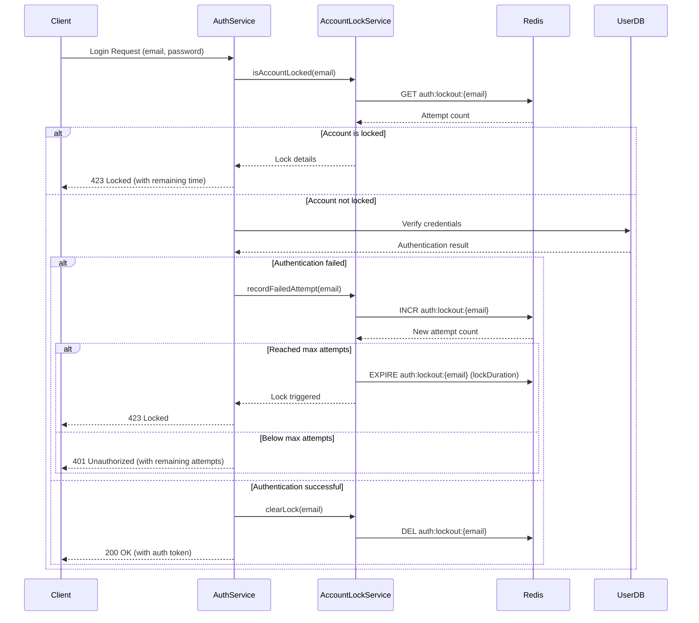

# Account Locking Workflow Documentation

## Overview
This document describes the complete workflow for handling failed login attempts and account locking in the authentication system.

## Workflow Diagram



## Step-by-Step Workflow

### 1. Initial Login Attempt
- Client sends login request with email and password
- AuthService checks if account is locked using `AccountLockService.isAccountLocked()`

### 2. Account Lock Check
- If account is locked:
  - Return 423 Locked status with remaining lock time
  - Client shows appropriate message to user
- If account is not locked:
  - Proceed with credential verification

### 3. Failed Authentication
- If credentials are invalid:
  - Record failed attempt with `AccountLockService.recordFailedAttempt()`
  - If max attempts reached:
    - Set Redis key with expiration (lock duration)
    - Return 423 Locked status
  - If below max attempts:
    - Return 401 Unauthorized with remaining attempts count

### 4. Successful Authentication
- If credentials are valid:
  - Clear any existing lock with `AccountLockService.clearLock()`
  - Generate and return auth token
  - Client stores token and proceeds to authenticated area

### 5. Lock Expiration
- Redis automatically removes key after expiration
- Subsequent `isAccountLocked()` calls will return false
- User can attempt login again

## Error Handling

### Expected Errors
| HTTP Code | Scenario | Client Response |
|-----------|----------|-----------------|
| 401 | Invalid credentials | Show error with remaining attempts |
| 423 | Account locked | Show lock timer |
| 500 | Server error | Show generic error message |

### Unexpected Errors
- Redis connection failures:
  - Log error
  - Fail open (allow login attempts)
- Invalid inputs:
  - Return 400 Bad Request
  - Log detailed error

## Recovery Process

### Automatic Recovery
- Locks automatically expire after configured duration
- User can try again after expiration

### Manual Recovery
1. Admin can clear locks via:
   ```bash
   ./manage-locks.sh clear
   ```
2. Or directly via Redis:
   ```bash
   redis-cli DEL auth:lockout:user@example.com
   ```

## Monitoring

### Key Metrics
- `failed_login_attempts_total`
- `account_locks_total`
- `lock_duration_seconds`
- `redis_commands_processed`

### Sample Prometheus Queries
```promql
# Rate of failed login attempts
rate(failed_login_attempts_total[5m])

# Currently locked accounts
count(account_locks_total)

# Average lock duration
avg(lock_duration_seconds)
```

## Security Considerations

1. **Fail Open**: If Redis is unavailable, the system allows login attempts
2. **No User Enumeration**: Error messages don't reveal if email exists
3. **Secure Storage**: Lock data stored in Redis with expiration
4. **Reasonable Defaults**: 5 attempts, 15 minute lock duration
5. **Monitoring**: All lock events are logged and monitored

## Testing Scenarios

### Happy Path
1. User enters correct credentials
2. Account is not locked
3. Authentication succeeds
4. Any existing lock is cleared

### Lock Trigger
1. User enters wrong password 5 times
2. 6th attempt returns 423 Locked
3. Subsequent attempts fail until lock expires
4. After expiration, user can try again

### Edge Cases
1. Empty email
2. Null password
3. Redis unavailability
4. Concurrent login attempts
5. Lock expiration race conditions
```